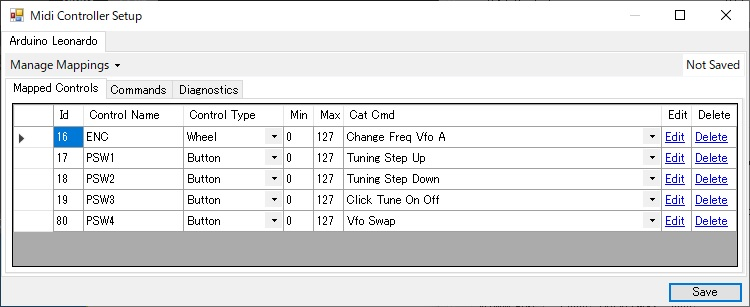

# VFO-Controller
MIDI Controller over USB for Thetis, PowerSDR.  
  
  
## Hardware
It consists of an Arduino Pro Micro (AliExpress), a rotary encoder and four push switches, and can be made with a very simple circuit at a low cost. There are still unused terminals on the Arduino, but I made it a controller that only has functions related to VFO.  
  
  
## Parts
- Arduino Pro Micro : 5V / 16MHz (AliExpress)
- Rotary Encoder :  KY040 encoder can be used (AliExpress). In my case, RE160F-40E3-20A-24P in my stock is used.
- Tactile Switch and Cap : (AliExpress)  
Refer to the photos and datasheet in Doc folder for these dimensions.  
## Software
It's also simple. Almost no programming is needed with using nice midi [_Control-Surface library_](https://github.com/tttapa/Control-Surface).  
## Enclosure
It's made with 3D printer. I used a knob removed from a junk audio set.  
## Thetis/PowerSDR setting
Encoder and switches are configurable freely.  Here is my setting.
  
I found [_useful youtube video_](https://www.youtube.com/watch?v=X81hrYqUJiQ&t=628s) to configure. 