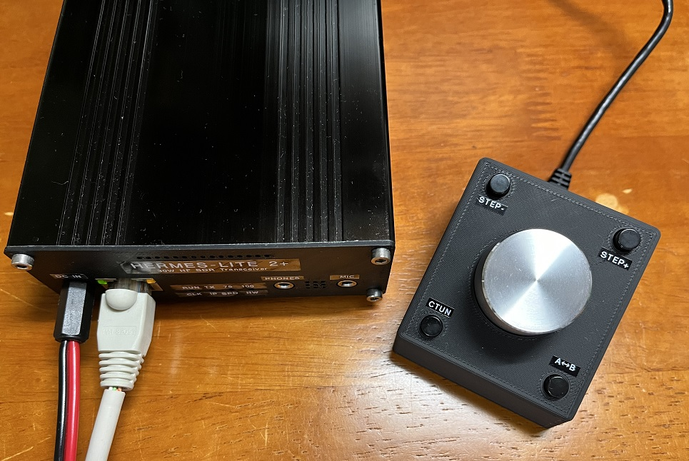
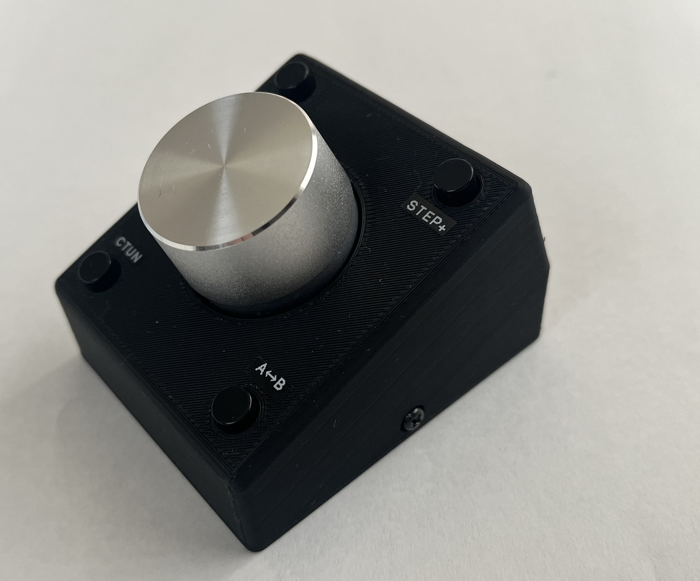
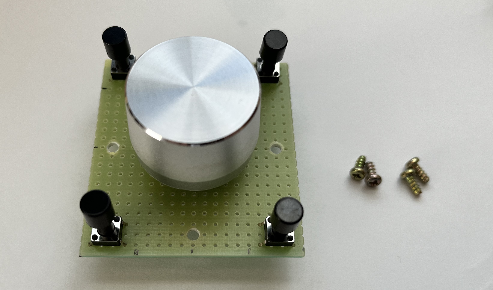
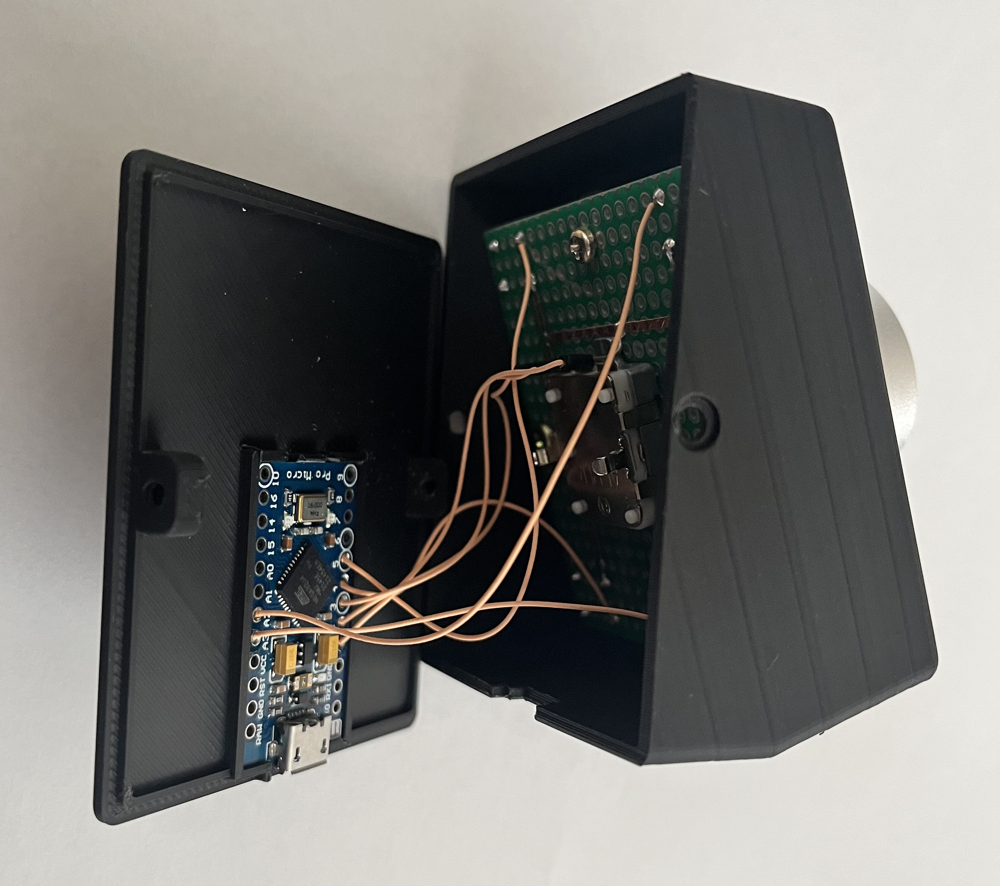

# VFO-Controller
MIDI Controller over USB for Thetis, PowerSDR and etc.  
  
  
## Hardware
It consists of an Arduino Pro Micro (AliExpress), a rotary encoder and four push switches, and can be made with a very simple circuit at a low cost. There are still unused terminals on the Arduino, but I made it a controller that only has functions related to VFO.  
  
  
## Software
It's also simple. Almost no programming is needed with using nice midi [_Control-Surface library_](https://github.com/tttapa/Control-Surface).  
## Enclosure
It's made with 3D printer. I used a knob removed from a junk audio set.